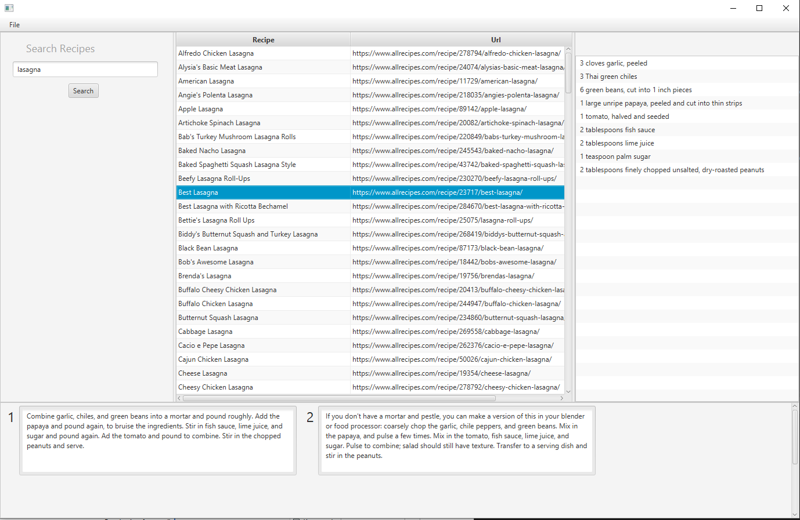
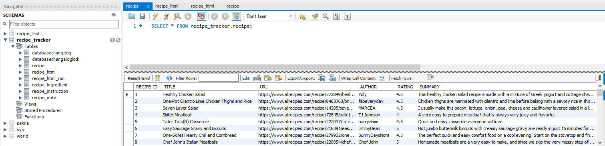
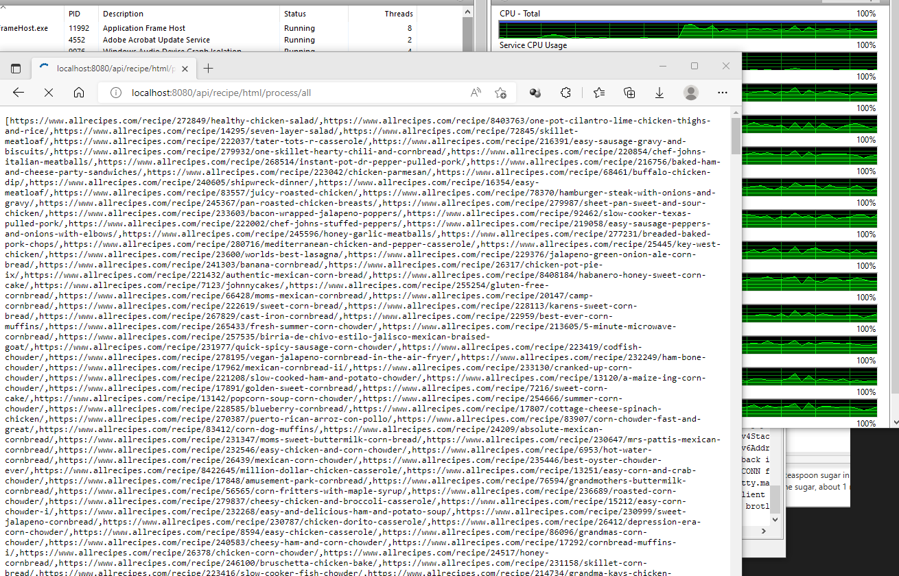

Copyright(C) 2022 Chris Liebert

# Overview
Searching for recipes on the web can be an overwhelming task at times: often I'll find at least 10 hits for what I'm searching and end up spending time compairing the ingredients and instructions before coming up with my own variant that works for what I have on hand and my personal preferences. Generally, the online recipe sources I use are full of ads and other content that I'm not interested in looking at when doing the comparison; I find myself loosing patience with the web browser and end up narrowing my compairson to just a few recipes, after all hunger is a driving factor in this process. 

Recipe-parent is a high-performance Java technology demo that crawls and downloads HTML from https://www.allrecipes.com/ and extracts ingredient and instruction information into a relational database; there is also a UI frontend browser for searching through recipe data. The modules consist of a web server API, crawler command-line tool, frontend recipe search browser and SQL database.

# Search Frontend
The frontend recipe browser provides a search capability and displays the critical information in one place, and also makes use of the Reactive Streams API to utilize multiple cores for a snappy interface.

# The Database
The recipe-database module requires an installation of MySQL, it uses Liquibase to apply the database migrations that create the schema. All access to the DB is routed through recipe-server.

# Crawling the Web
Crawling the allrecipes.com can take several hours to download. The RECIPE_HTML table is all the crawl process will load, it stores compressed HTML blobs for each recipe visited. In order to support quick changes to the HTML parsing recipe extraction code is handled separatly by the recipe-server API so this can be re-run without crawling the web.

# Parsing the HTML
Initiating a GET request to /api/recipe/html/process/all will start the extracting process which will return a list of the URLs that were processed in realtime using Reactive Streams to utilize the full potential of all available CPU cores.

This software is intended for technology demonstration purposes only.
